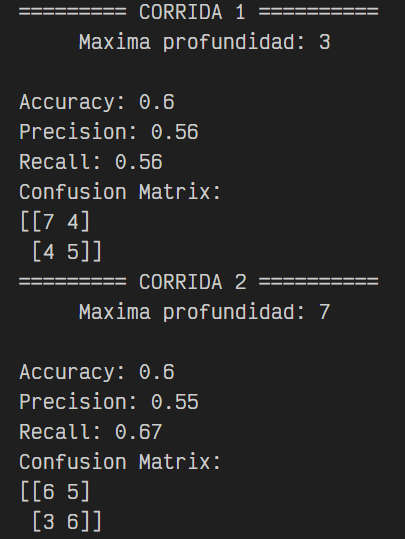

# Implementación de una técnica de aprendizaje máquina

- Programa uno de los algoritmos vistos en el módulo (o que tu profesor de módulo autorice) sin usar ninguna biblioteca o framework de aprendizaje máquina, ni de estadística avanzada. Lo que se busca es que implementes manualmente el algoritmo, no que importes un algoritmo ya implementado. 
- Prueba tu implementación con un set de datos y realiza algunas predicciones. Las predicciones las puedes correr en consola o las puedes implementar con una interfaz gráfica apoyándote en los visto en otros módulos.

## Pasos para correr el código

Primero debe descargar el codigo fuente que se encuentra en el archivo **decision_tree.py**. 

Lo recomendable es crear una carpeta y guardar el archivo en la misma para después abrir la carpeta con algún editor de código de preferencia. En mi caso ocupo [VS Code](https://code.visualstudio.com/) para poder correr el archivo. 

Una vez abierta la carpeta en su editor de código debe iniciar una terminal y verificar que el directorio se encuentra en la ruta donde está el archivo **decision_tree.py**

Lo siguiente será crear un entorno virtual de python para instalar las librerías dentro de él y que no afecte otro lado. Para hacer esto debe correr el siguiente comando

    python -m venv nombreEntornoVirtual

** Puede cambiar el nombre del entorno remplazando _nombreEntornoVirtual_ por el que quiera.

Una vez que se ha creado el entorno virtual se debe activar, para esto debe correr

    nombreEntornoVirtual\Scripts\activate

Podrá observar en la terminal que el directorio cambiará y tendrá el siguiente formato

**(nombreEntornoVirtual)** PS C:\Users\TuRuta

Una vez creado e inicializado el entrorno virtual podemos instalar las librerías necesarias para poder correr el código así que ingresa el siguiente comando en la terminal

    pip install numpy scikit-learn

El comando anterior permite instalar numpy que se ocupa para poder separar el dataset y hacer modificaciones. Scikit-learn se ocupa para evaluar la eficiencia del código. Una vez que se tienen las librerías instaladas puede ejecutar el siguiente comando en la consola para correr el codigo de la implementacion.

    python decision_tree.py

Una vez que se haya corrido el código en la terminal se podrá observar 2 corridas como en la siguiente imagen. 

Las corridas siempre saldrán diferentes ya que el código está diseñado para que genere datos random en cada una de las corridas así que nunca serán las mismas.

Para desactivar el entorno virtual de python debe correr el siguiente comando en la terminal

    deactivate

** Si quiere volver a correr el código, asegúrese de que tiene el entorno virtual activo ya que de lo contrario marcará error

